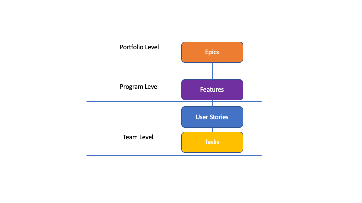

# `Azure Devops Project Management`

- In Azure Devops We have Multiple Releases which been further devided into multiple Sprint
- Typically The Sprint consist of 2 weeks of the time and Each 4 sprint construct a Release
- Sprint:-short duration milestone, releases splitted into multiple sprints
- go to the project setting &rarr;project configurration &rarr; delete the default sprint by click then `...` option  &rarr;Then we can create our own iteration &rarr;
  click on the new child item underneath the project &rarr; we can create the release with start and end date &rarr;
- we can have multiple sprint undearneath the release hance slect the release &rarr;new child item &rarr; select the sprint start and end date
- we can create multiple sprint under the particular release
- There will be section called as area and for every team there sgould be an area
- Area is when we gather requirements in order to segregate requirementes into different Area we can devide it

#### Make Sure Iteration(Releases and Sprint) available for the Team

- click on the project settingd &rarr; Team Configuration &rarr; Select the Issue Tpe as ( Epics, Feature,Backlogs) &rarr; click on iterations &rarr; click on the + option
  to select iteration and select the corresponding Release and Sprint (you can select All 3 operation)
- Now if we see in the team configuration &rarr; The Iteration then we can see those iteration over the Teams Configuration Page so that Team can see the info required
- in Azure Devops The Hierarch as below
  
- Epics:- An Epic can Take Many/Multiple Releases to be completed, Epics are devided into multiple feature
- Features:-An Feature Takes Multiple Sprint to be get completed but can have only 1 release  per feature, Feature can be devided into multiple User Story
- User Story:-An User Story should be completed with in  1 Sprint,User Story can be devided into multiple task
- Task:- A Task Requirement which can take a day or 2 to be get complete,measure in term of hours

#### How to Create Different Issue Type in Azure Board

#####    How to Create Epics in Azure Devops :-

- select the Project &rarr; click on the board &rarr; work Item &rarr; click on new Work Item &rarr; Select Epic &rarr; provide the description and Also recomended to
  provide abbreviation for the same &rarr; One Person always in charge of the Epic which can be product owner So on the user as in charge &rarr; also can
  add the Tags which can be any string , in any number &rarr; selection the state as New and Reason as New Epic which is the Only option and once we
  save the Epics we can see moreoption underneath that &rarr;Select the Area as the Project Name &rarr; Select the Iteration as the Project (As the Epic can
  take multiple release hence we are not selecting the release rather we are selecting the project ) &rarr; We can provide the DDescription as Markdown
  &rarr; provide  The Acceptance Criteria &rarr; On the Discussion is same as comment we can Jira &rarr; we can provide Tentive Start and End Date(which mostly
  not provided for epics)  &rarr; we can define the Priority on the Epic as well (1 is of High Priority and 4 is of low priority) &rarr; effort are measure for estimate
  which is based on the User Story Points (Fibonacci Series Points) which is mandetory for user story but not that mandetory for epics and feature &rarr;
  Attach the docs on the right hand side &rarr; we can select the History and Link Later &rarr; Click on the Save Option

##### How to Create BackLog Feature for the Epics:-

- Go to the Project &rarr; select the backlog & select the project &rarr; click on the backlog Item on the Right & select Epics which will display all the available
  epics that we created &rarr; To create a Backlog Feature then click on the epics that displayed and click on the `+` Button  which will add the fiture and
  if the Page `+` option not visible then that eman we have `Stake Holder Or Read Only`  Access  &rarr; for the Scrum Template its showing should be new feature
  if showing as new issue then that means you are not working in a Scrum Templated Project
- If you want to fetch the `+` option then go to Project Setting &rarr; make sire that you have the Contributor or Project Administrator Access in the Security Section
- we can validate the Project is of scrum templated or not by using the project setting &rarr; Overview &rarr; Process Should be of Scrum  , if this process
  showing as basic then we are not in an Scrum Templated Project
- Basic Project Template only Let you to create Epics ,Issue and Task bit not on Featur and User Story which is avaible in scrum template
- Creating the Feature will be similar as creating the Epics But we need to mention few additional details such as below
  - we need to provide the iteration as the release that we created
  - In the Description block we can use the # to mention the existing workitem
  - By using the Another WorkItem By using the # symbol we can link the backlog feature to it
  - we can use the `!` symbol to associate a pull request in the Description or Acceptance Criteria or Discussion section
  - we can Edit the Epics and Backlog Feature by click on them
  - the link tab will show the parent and child Item for the Backlog Feature as well as the Epics

##### How to Associate User Story top the Particular Feature

- The User Story Must be completed with in particular sprint i.e 2 weeks , a feature can be devided into multiple user story
- we can select Epis/Feature to see all the Epics and Feature in the backlog items
- Azure Default Provide that as PBI as Product backlog Item (alternate name of user story ) /bug from the feature
- we can create PBI from backlog feature by clicking on the `+` option
- Same  as Feature and Epics we can also edit the PBI but have to amend few details such as Below

  - Iteration should be Associated to a particular sprint
  - here we don't have a start and end date button but we do have priority and Effort to be put in
  - we can create multiple PBI associated with the Feature
  - Its also show the parent and child item by clicking on the link option which will show the parent as the particular feature and for the feature it has the child option now
  - By the dropdown instead of save and close we can select save option only
- we can adjust the width of the column
- if we want to see additional details on the workitem column then go to `column options` and from there we can choose the column we want to see in the Work Item by `adding a column or remove the column`
- we can also re-arrange the WorkItem Column by the `column option` and `drag and drop` the particular column in there

##### How to Associate the Task into the PBI or User Story

- We can click on the PBI to create the Task  and Same as PBI and Feature and EPIC we can fill these up
- But we need to Provide the Iteration as the Sprint as Task can be completed in couple of hours
- we can also select the Priority ,same as PBI we don;t have a start and End Date for it
- Few Field we need to Provide additionally and  those fields are
  - Remaining Work :- Mentioned with How long in hr the process will take
  - Activity :- What Type of Activity this one will be
  - Blocked :- Is this Task been blocked by any other Task or not
